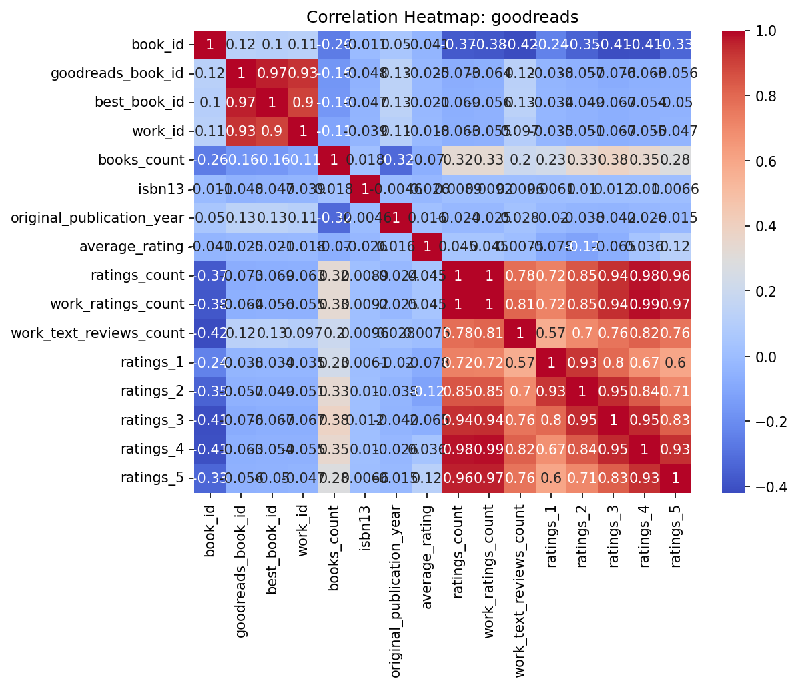
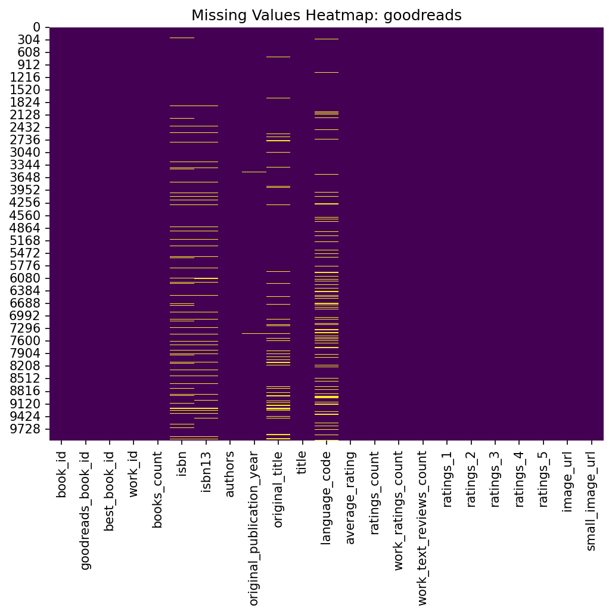
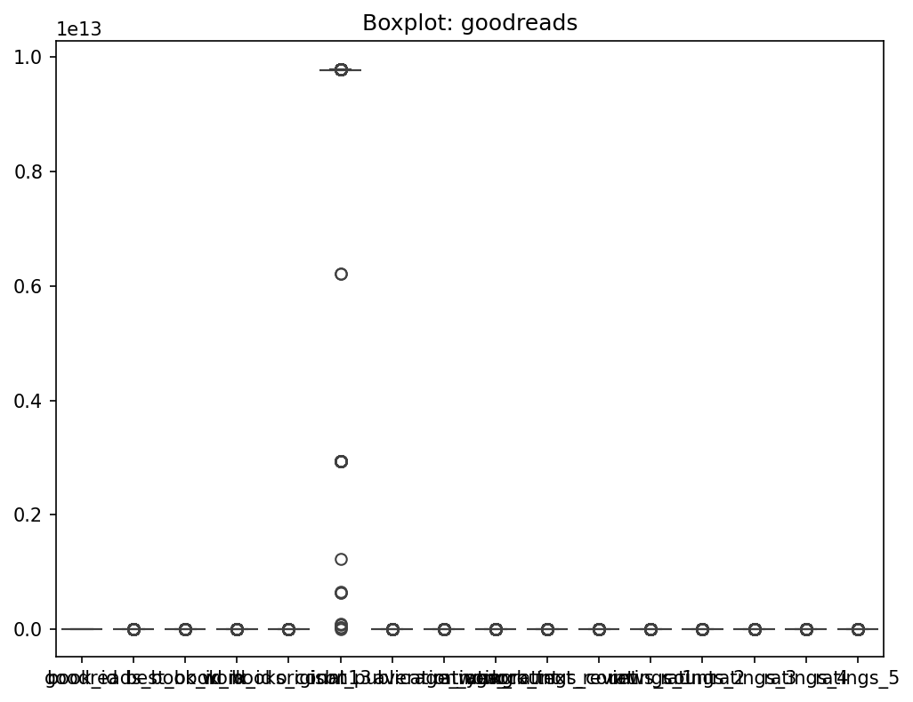

# Analysis of goodreads

## Dataset Insights and Recommendations

### Business Report
# Goodreads Dataset Analysis Report

## Executive Summary

This report presents an analysis of the Goodreads dataset, covering crucial statistics, correlations, and visual insights that can guide strategic decisions and improvements for the platform. The findings reveal significant trends in book ratings, authorship, and publication years, highlighting areas for potential enhancement.

## Key Findings

### Summary Statistics

- **Books Count**: On average, a book has around 75.71 authors, with a maximum count of 3455. This indicates a possible trend of prolific authors or anthologies, which warrants further exploration.
- **Average Rating**: The mean average rating across 10,000 books is approximately 4.00, suggesting many reviewed books are well-received by readers.
- **Publication Trends**: The average original publication year is 1982, indicating a healthy mix of contemporary and classic titles available on the platform.

### Missing Values

- **ISBN and Language Codes**: Significant gaps exist in the `isbn` (700 missing) and `language_code` (1084 missing). This could affect discoverability and search functionality for users.
- **Original Titles**: A considerable number of books lack original titles (585 missing), complicating users' understanding of adaptations or original works.

### Correlation Insights

- **Ratings Correlation**: There is a strong correlation (0.98) between total ratings and work ratings. This signals consistency in reader engagement across different metrics.
- **Authors and Ratings**: Books by more prolific authors (those with higher `books_count`) tend to have a negative relationship with average ratings (-0.0698). This could suggest that quantity may sometimes compromise quality, implying that not all prolific authors maintain high standards.

## Surprising Trends

- **High Ratings with Low Counts**: Some books achieve high ratings yet have relatively low ratings count. This may suggest niche preferences or successful marketing strategies for specific titles.
- **Publication Year Effects**: There appears to be a weak correlation (0.133) between publication year and ratings. This indicates a potential opportunity for promoting older titles that still receive favorable reviews.

## Recommendations for Action

### Data Improvement

- **Enhancing Metadata**: Address the missing values in the ISBN and original titles to improve searchability and usability. Implement a systematic process for collecting and validating this information from users and authors.
- **Language Diversity**: Consider enabling more user-generated content for languages other than English, enhancing accessibility and user experience for non-English speakers.

### Marketing Strategies

- **Focus on High-Rated Low-Count Books**: Create marketing campaigns around books that have high ratings but a low number of ratings, fostering greater engagement from niche audiences.
- **Promote Classic Titles**: Highlight older titles that receive consistent positive reviews to tap into the classic literature market and engage users seeking timeless reads.

### Strategic Decision Making

- Leverage the insights on author output and ratings to establish partnerships with successful authors for exclusive content or promotional activities.
- Use the correlation analysis to inform future acquisition strategies, focusing on works that tend to receive favorable ratings and reader engagement.

## Conclusion

The Goodreads dataset provides a rich landscape for understanding user preferences and book performance. By addressing data gaps and leveraging insights on ratings and author behavior, Goodreads can enhance its offerings, engage its audience more effectively, and drive growth. Implementing these recommendations can position Goodreads strategically as a leader in the book discovery space.

### Visualizations

