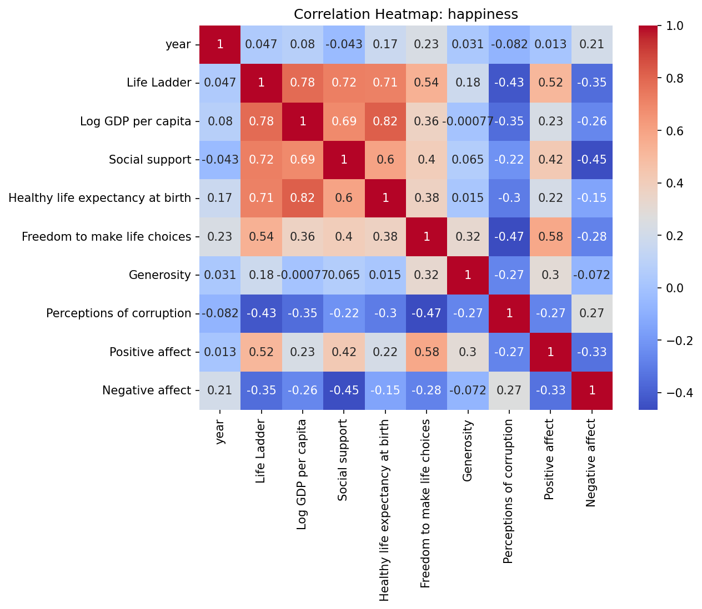
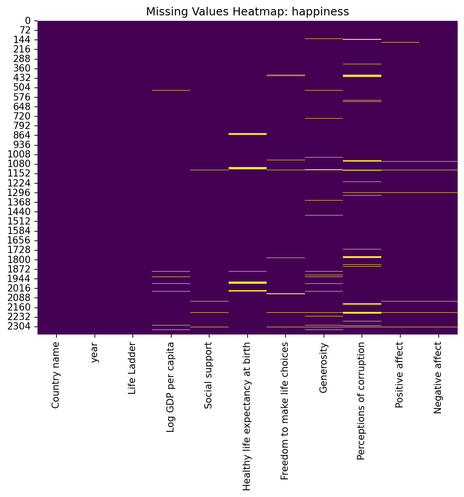
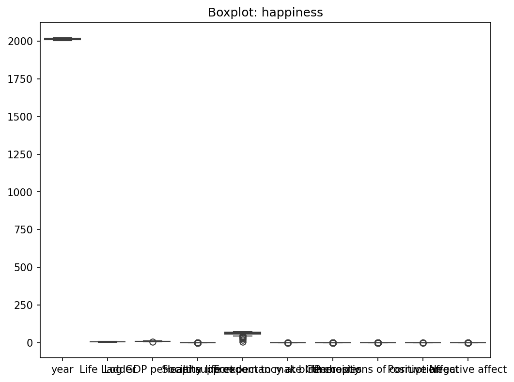

# Analysis of happiness

## Dataset Insights and Recommendations

### Business Report
# Business Report on Happiness Dataset Insights

## Executive Summary
The analysis of the happiness dataset reveals valuable insights into the factors impacting life satisfaction across various countries over the years. Key variables assessed include GDP per capita, social support, life expectancy, freedom to make life choices, generosity, perceptions of corruption, and emotional well-being (positive and negative affect). The correlation matrix and summary statistics provide a foundation for strategic decision-making aimed at enhancing overall happiness indicators.

## Key Findings

### 1. Positive Correlations
- **Strong Links**: Notable strong correlations exist between "Life Ladder" (a measure of happiness) and both "Log GDP per capita" (0.78) and "Social support" (0.72). This indicates that economic prosperity and social connections significantly contribute to happiness levels.
- **Emotional Well-Being**: Positive affect correlates positively with the Life Ladder (0.51) while negative affect shows a negative correlation (-0.35). This suggests that promoting emotional well-being can enhance happiness scores.

### 2. Missing Data
- Several key indicators show missing data, particularly in "Generosity" (81 missing entries) and "Perceptions of corruption" (125 missing entries). These gaps may affect comprehensive analyses and lead to incomplete understanding of happiness drivers in certain countries.

### 3. Yearly Trends
- The mean year of the dataset is approximately 2014.76, ranging from 2005 to 2023. This suggests longitudinal insights into how happiness factors may have shifted over nearly two decades.

### 4. Low Generosity Indicators
- The mean generosity score is very low (9.77e-05), indicating potential societal challenges regarding charitable behavior and community support, which could detract from overall happiness.

## Surprising Trends
- The **negative correlation** between "Perceptions of corruption" and "Life Ladder" (-0.43) stands out, highlighting that higher corruption perceptions are associated with decreased happiness. This suggests that improving governance and reducing corruption perception could be essential strategies for enhancing happiness.

## Recommended Actions

### 1. Improve Economic Stability
- **Action**: Develop initiatives that promote sustainable economic growth, increase job opportunities, and elevate GDP per capita. This can include targeted investment in developing regions or sectors that require economic stimulation.
- **Rationale**: As GDP per capita is strongly correlated with happiness, economic benefits directly translate into improved well-being.

### 2. Strengthen Social Support Networks
- **Action**: Encourage community-based programs and social initiatives that foster strong social relationships. This could involve volunteer programs, community outreach, or support groups.
- **Rationale**: Given the significance of social support in enhancing life satisfaction, fostering these relationships should be a priority.

### 3. Address Perceptions of Corruption
- **Action**: Implement transparency initiatives and strengthen governance practices to reduce corruption perceptions. Regular public reporting on government actions and spending can build trust.
- **Rationale**: Since corruption perceptions negatively impact happiness levels, addressing this can improve public satisfaction and trust in institutions.

### 4. Enhance Emotional Well-Being
- **Action**: Promote mental health awareness campaigns and programs, focusing on emotional resilience and well-being.
- **Rationale**: Emotional health significantly impacts overall happiness. Investing in mental health can reduce negative affects, contributing to an increase in overall life satisfaction.

### 5. Data Completeness Improvement
- **Action**: Implement systematic data collection to address missing values, particularly in critical variables like Generosity and Perceptions of corruption and utilize data enrichment techniques.
- **Rationale**: Better data completeness leads to more reliable insights, guiding effective strategic decisions.

## Strategic Decisions
The dataset provides a crucial basis for enhancing happiness through economic and social reforms. Leveraging insights from the correlations can direct investment and policy efforts towards areas that maximize societal well-being. Metrics on happiness can also serve as benchmarks for future success, providing clear indicators for measuring improvement.

By addressing the identified gaps and focusing on strategic implementations, organizations and governments can make significant strides towards fostering overall happiness in societies, which in turn can lead to greater societal stability and productivity.

--- 

This report emphasizes how the identified relationships and missing variables can shape tactical approaches moving forward, enhancing both organizational and societal outcomes in the context of happiness.

### Visualizations

