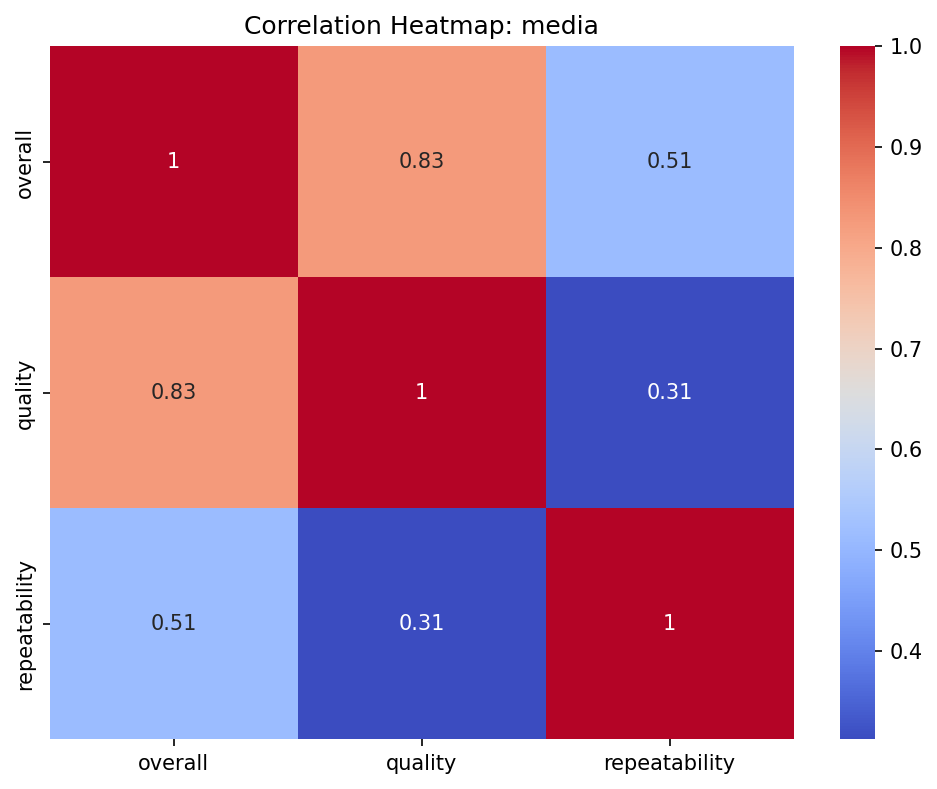
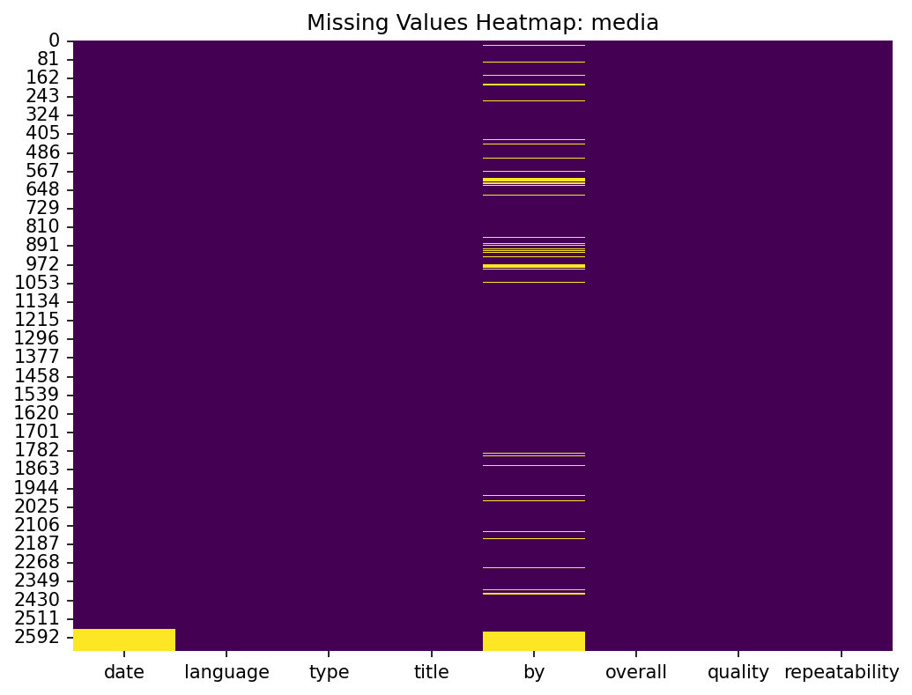
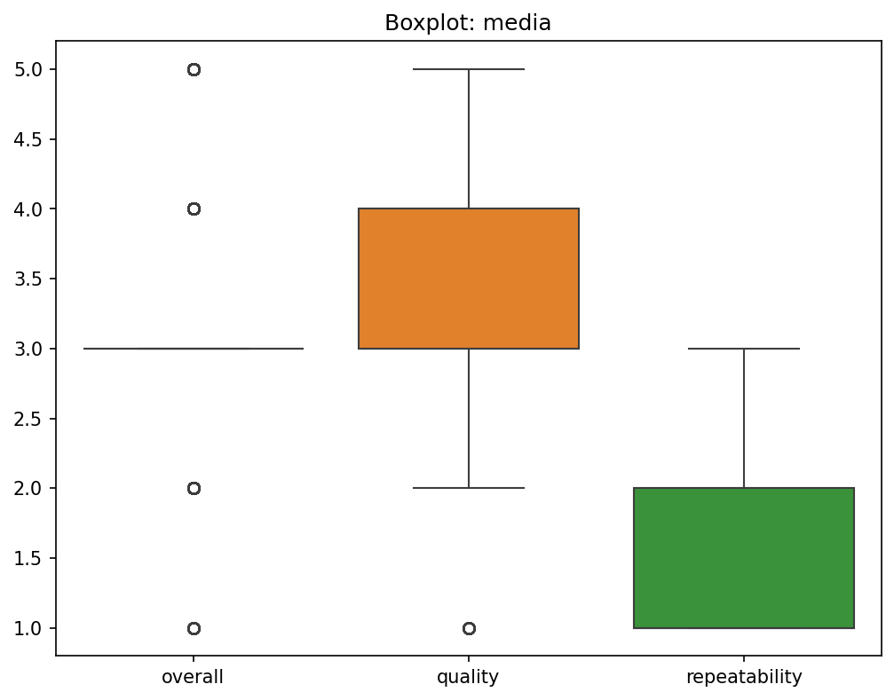

# Analysis of media

## Dataset Insights and Recommendations

### Business Report
# Business Report on Media Dataset Analysis

## Executive Summary

The analysis of the media dataset provides valuable insights into the characteristics and trends of the media entries. With a focus on variables such as date, language, type, title, ratings, and repeatability, we uncover key aspects that can inform business strategies, enhance media offerings, and improve user engagement.

## Key Findings

1. **Data Coverage and Gaps**:
   - A total of 2,652 entries were recorded, with notable missing values in the 'date' (99 entries) and 'by' (262 entries) fields. The absence of these values suggests potential gaps in data collection efforts.
   - The ‘date’ field holds significant value for time-based analyses, and improving data acquisition processes here could yield better insights.

2. **Language Distribution**:
   - The dataset contains media in 11 different languages, with ‘English’ being the most prevalent (1306 entries). This indicates a strong preference for English content and suggests a potential market focus.

3. **Type of Media**:
   - The dataset largely consists of movies (2,211 entries), pointing to a predominant market interest in this format. Attention to this medium could enhance content strategy and curation.

4. **Ratings Overview**:
   - The overall rating mean is approximately 3.05, with a standard deviation of 0.76, indicating moderate satisfaction among users. The ‘quality’ rating, with a mean of 3.21, suggests a slightly higher perceived quality. However, both ratings exhibit relatively tight distributions, with the majority scoring around the median.
   - There is a strong positive correlation (0.83) between overall ratings and quality ratings, suggesting that improving perceived quality could directly enhance overall satisfaction.

5. **Repeatability Insights**:
   - The mean repeatability score is 1.49, indicating that most users do not prefer to revisit the content. Enhancing elements that drive repeat viewing or engagement, such as series or sequels, could be beneficial. 

6. **Analysis of Content Creators**:
   - With 1,528 unique contributors and Kiefer Sutherland being the most frequent (48 contributions), this highlights potential influencer partnerships or exploration of similar creators to boost content variety.

## Recommended Actions

1. **Focus on Missing Data**:
   - Develop a strategy to improve data collection for missing 'date' and 'by' fields, potentially integrating user prompts or enhancing input interfaces to ensure completeness.

2. **Content Strategy Enhancement**:
   - Given the dominance of English language content, consider expanding media offerings in other popular languages identified in the dataset. This could exponentially increase engagement and reach with diverse audiences.

3. **Quality over Quantity**:
   - Invest in enhancing the quality of media productions based on highly rated elements. Use feedback loops and surveys to pinpoint attributes that elevate quality perceptions.

4. **Encouraging Repeat Viewership**:
   - Analyze content characteristics that may encourage repeat viewership. Experiment with formats or marketing strategies that leverage popular titles or engaging narrative styles.

5. **Leveraging Influencer Insights**:
   - Explore collaborations with frequently appearing creators to replicate the success. This could include promotional strategies that feature familiar faces or styles that have received favorable ratings.

## Strategic Implications

The insights gained from this dataset present crucial opportunities for strategic business improvements. Leveraging data to guide content curation and creation processes, targeting underserved language markets, and focusing on quality enhancement will foster user satisfaction and loyalty. Additionally, the exploration of influencer relationships can provide competitive advantages in the crowded media landscape.

By continuously monitoring and adapting based on this type of data analysis, the organization can ensure that its media offerings remain aligned with audience preferences, ultimately driving engagement and profitability.

### Visualizations

